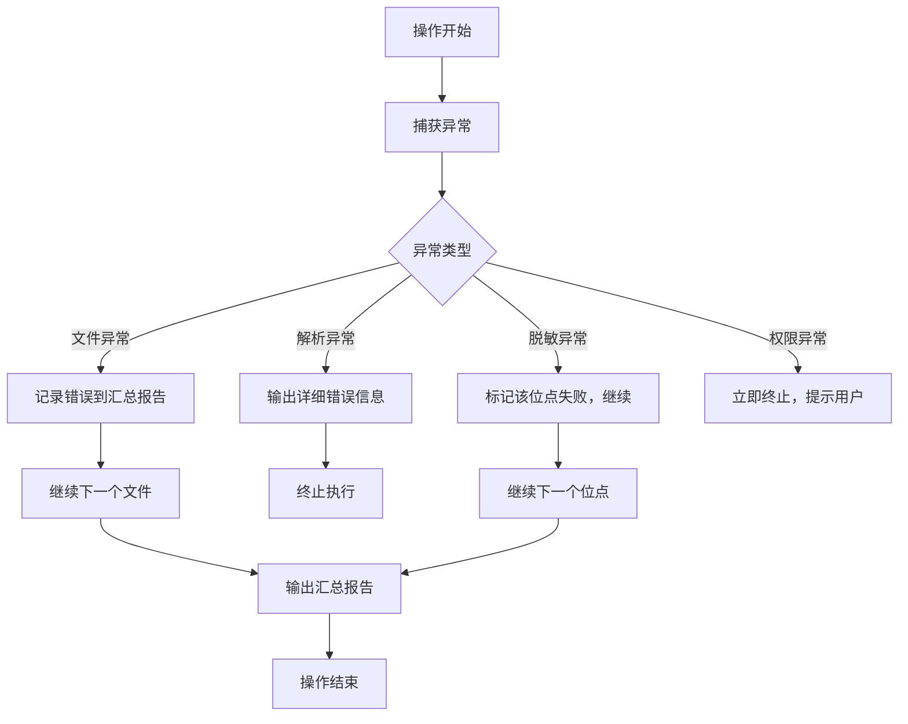

版本：v1.0 | 状态：正式版 | 最后更新：2026-08-29

目录

1. 概述
2. 术语表
3. 需求说明
4. 架构设计
5. 模块设计
6. 数据模型
7. 接口设计
8. 算法设计
9. 异常处理
10. 非功能性需求
11. 交付物清单
12. 实施计划
13. 风险与应对

一、概述

1.1 项目背景

财务部门在日常工作中需要频繁处理包含高度敏感信息的报表和分析报告，这些文件通常以 Microsoft Excel（.xlsx）和 PowerPoint（.pptx）格式存在。在对外分享、跨部门协作、提交审计或用于演示等场景下，必须对文件中的敏感信息进行脱敏处理。

当前工作模式为完全手动操作，存在以下痛点：

痛点 具体表现
效率低下 每份报告需逐页逐格手动查找并替换，处理一份复杂报告耗时数小时
标准不一 不同财务人员脱敏标准不统一，同一份文件多次处理结果不一致
容易遗漏 隐藏行/列、批注、图表数据表等隐蔽位置常被忽略，造成泄密风险
无法追溯 无法审计"改了什么、谁改的、何时改的"，不符合合规要求
重复劳动 相似报表需重复执行相同的脱敏操作，无法复用脱敏规则

1.2 项目目标

开发一款纯本地运行的财务文件智能脱敏工具（Python CLI 原型版），实现：

1. 智能发现：自动扫描 PPTX/XLSX 文件中的所有潜在敏感内容
2. 策略可审：生成可人工审核和编辑的脱敏策略文件（YAML 格式）
3. 一键执行：按策略自动执行脱敏，同时记录所有修改位点
4. 可溯源：在脱敏文件中嵌入抗删除的隐形水印，实现分发文件溯源

1.3 适用范围

维度 范围
输入格式 Microsoft PowerPoint (.pptx)、Microsoft Excel (.xlsx)
脱敏对象 公司/机构名称、客户姓名/联系人、各类金额数值、账号/合同编号
输出格式 脱敏后的同格式文件（保留原排版和格式）+ JSON 格式位点日志
运行环境 Windows / macOS / Linux（Python 3.10+）

二、术语表

术语 英文 定义
脱敏 Redaction / Sanitization 将敏感信息转换为不可识别但保留可用性的过程
位点 Site / Location 单个敏感数据在文件中的精确位置标识
列头定位 Column-based Detection 根据表格列名（表头）定义该列所有单元格的脱敏规则
零宽字符 Zero-width Character Unicode 中宽度为零的控制字符（如 \u200B），肉眼不可见
脱敏策略 Redaction Strategy YAML 格式的策略文件，记录所有位点的脱敏方式和参数
位点日志 Audit Log JSON 格式的日志，记录脱敏前后完整映射关系
扰动 Perturbation 金额脱敏模式之一，在原始值 ±X% 范围内随机偏移
降低精度 Precision Reduction 金额脱敏模式之一，保留到指定数量级（万/百万/亿）
遮掩 Masking 金额脱敏模式之一，仅保留首位数字，其余替换为星号
敏感类型 Sensitive Type 敏感数据的分类，如 amount（金额）、entity（机构）、person（人员）

三、需求说明

3.1 功能需求

FR-01：文件输入

编号 需求描述 优先级
FR-01.1 支持输入单个 .pptx 或 .xlsx 文件 P0
FR-01.2 支持输入文件夹路径，批量处理所有支持的格式文件 P0
FR-01.3 输入文件不存在或格式不支持时，给出明确的错误提示 P0

FR-02：敏感内容发现（双引擎）

编号 需求描述 优先级
FR-02.1 正则/关键字引擎：对全文（PPT文本框、Excel所有单元格）执行正则匹配和关键字匹配 P0
FR-02.2 内置金额正则：匹配 \d{1,3}(,\d{3})*(\.\d{2})? 模式 P0
FR-02.3 内置机构名正则：匹配 [\u4e00-\u9fa5]{2,4}(公司\|集团\|银行\|证券\|基金) P0
FR-02.4 内置关键字列表：营业收入、净利润、总资产、合同金额、客户名称、账号等 P0
FR-02.5 列头定位引擎：读取 Excel 表格的表头行，根据列名匹配脱敏规则 P0
FR-02.6 列头匹配支持精确匹配、正则匹配两种方式 P0
FR-02.7 列头匹配优先级：精确匹配 > 正则匹配 > 全文扫描（兜底） P0
FR-02.8 PPT 中的标准表格同样应用列头定位引擎 P0
FR-02.9 PPT 中图表关联的数据表也应纳入扫描范围 P1
FR-02.10 扫描结果自动打标签：amount / entity / person P0
FR-02.11 为每个位点推荐脱敏方式（如金额默认使用"降低精度"） P0

FR-03：脱敏策略生成

编号 需求描述 优先级
FR-03.1 将扫描结果导出为 YAML 格式的策略文件 P0
FR-03.2 策略文件包含所有位点的位置、原始值、敏感类型、推荐的脱敏方式和参数 P0
FR-03.3 策略文件中每个位点均可通过 enabled: true/false 控制是否执行脱敏 P0
FR-03.4 策略文件使用 ruamel.yaml 保留格式和注释，便于人工编辑 P1
FR-03.5 策略文件应包含元数据（源文件、生成时间、总位点数） P0

FR-04：脱敏执行

编号 需求描述 优先级
FR-04.1 读取 YAML 策略文件，按每个位点的 action 和 params 执行脱敏 P0
FR-04.2 金额脱敏支持三种可选模式（详见 FR-05） P0
FR-04.3 机构名称脱敏：替换为自定义代号（如 [公司A]），支持映射表 P0
FR-04.4 客户姓名脱敏：仅保留姓氏，其余替换为 *（如 张三 → 张*） P0
FR-04.5 账号/合同号脱敏：保留前3位和后4位，中间替换为 **** P1
FR-04.6 脱敏后文件保留原格式、排版、图表、公式等所有视觉元素 P0
FR-04.7 支持 --default-policy 快速模式，使用内置默认策略直接脱敏 P1

FR-05：金额脱敏三种模式

模式 说明 参数 示例（原始：12,345,678.90元）
降低精度 保留到指定数量级（万/百万/亿），四舍五入 unit, decimal_places 12.35百万元
随机扰动 在 ±X% 范围内随机偏移，总量守恒 percentage 11,987,654.00（偏移-2.9%）
遮掩 仅保留首位数字，其余替换为 * 无 1*,***,***.**

FR-06：位点记录（审计日志）

编号 需求描述 优先级
FR-06.1 每次脱敏生成一份 JSON 格式的位点日志 P0
FR-06.2 日志精确记录每个位点的：位置标识、原始值、脱敏后值、使用的脱敏方式 P0
FR-06.3 Excel 位点定位到：工作表名 + 单元格坐标 + 列名 P0
FR-06.4 PPT 位点定位到：幻灯片编号 + 形状ID + 表格坐标（如适用） P0
FR-06.5 日志包含：操作人、时间戳、文件哈希值、总修改数 P0
FR-06.6 日志文件与脱敏文件同目录输出，命名规则：{原文件名}_日志.json P0

FR-07：隐形水印

编号 需求描述 优先级
FR-07.1 使用 Unicode 零宽字符（\u200B、\u200C）编码水印信息 P0
FR-07.2 水印内容包括：操作人ID + 脱敏时间戳 + 文件哈希值 P0
FR-07.3 多点冗余嵌入：水印分散嵌入文件多个位置，提高抗删除能力 P0
FR-07.4 PPT：嵌入所有文本框末尾（句号或空格之后） P0
FR-07.5 Excel：嵌入所有工作表首个非空单元格末尾 P0
FR-07.6 删除 50% 嵌入点后，剩余水印仍可重组解码（检出率 ≥ 80%） P1
FR-07.7 提供独立的水印解码工具，用于验真 P1

FR-08：批量处理

编号 需求描述 优先级
FR-08.1 输入文件夹时，递归遍历所有 .pptx 和 .xlsx 文件 P0
FR-08.2 批量模式下，每个文件独立生成对应的脱敏文件和日志 P0
FR-08.3 显示处理进度（当前文件序号/总数）和实时状态 P0
FR-08.4 单个文件处理失败不影响其他文件（继续处理，最后汇总报告） P1
FR-08.5 输出汇总统计：成功数、失败数、总修改位点数 P0

3.2 用户场景

场景一：首次处理新报告

```
用户操作：
1. 执行命令：python main.py generate -i 2024年度财务报告.pptx -o 策略.yaml
2. 工具扫描文件，输出 47 个敏感位点
3. 用户打开策略.yaml，审核每个位点的脱敏方式
4. 用户微调部分位点的 action 或 params
5. 保存策略文件

预期结果：得到一份可复用的脱敏策略文件
```

场景二：执行脱敏

```
用户操作：
1. 执行命令：python main.py redact -i 2024年度财务报告.pptx -s 策略.yaml -o ./输出/ --operator finance_zhang
2. 工具按策略执行脱敏
3. 工具在脱敏文件中嵌入水印
4. 工具生成位点日志

预期结果：得到脱敏文件 + 日志文件，文件可安全外发
```

场景三：批量处理季度报表

```
用户操作：
1. 将 Q1、Q2、Q3、Q4 四个季度的报表放入 ./待处理/ 文件夹
2. 执行命令：python main.py redact -i ./待处理/ -s 策略.yaml -o ./脱敏输出/ --default-policy
3. 工具依次处理四个文件

预期结果：四个文件均完成脱敏，并带有各自独立的日志
```

四、架构设计

4.1 总体架构

系统采用分层架构，自上而下分为：

层级 职责 核心组件
表示层 命令行交互，参数解析，终端输出 click, rich
应用层 业务流程编排（生成策略 / 执行脱敏） main.py 命令函数
核心引擎层 扫描、脱敏、水印、审计等业务逻辑 Scanner, Redactor, Watermark, Audit
数据模型层 数据结构定义与校验 Pydantic Models
基础设施层 Office 文件读写、文件系统操作 openpyxl, python-pptx

4.2 组件视图

```
┌─────────────────────────────────────────────────────────────────────────┐
│                           表示层（CLI）                                │
│              click 命令定义  |  rich 美化输出  |  参数校验             │
└─────────────────────────────────────────────────────────────────────────┘
                                    │
                                    ▼
┌─────────────────────────────────────────────────────────────────────────┐
│                           应用层（流程编排）                            │
│     ┌─────────────────────┐          ┌─────────────────────────────┐   │
│     │  generate 命令      │          │  redact 命令                │   │
│     │  1.调用Scanner扫描  │          │  1.加载YAML策略             │   │
│     │  2.生成Site列表     │          │  2.调用Redactor执行脱敏     │   │
│     │  3.导出为YAML       │          │  3.嵌入水印                 │   │
│     │                     │          │  4.生成日志                 │   │
│     └─────────────────────┘          └─────────────────────────────┘   │
└─────────────────────────────────────────────────────────────────────────┘
                                    │
                                    ▼
┌─────────────────────────────────────────────────────────────────────────┐
│                           核心引擎层                                    │
├─────────────────────────┬───────────────────────────────────────────────┤
│       Scanner           │              Redactor                         │
│  ┌───────────────────┐  │    ┌───────────────────────────────────┐     │
│  │ ExcelScanner      │  │    │ AmountRedactor                   │     │
│  │ - 列头匹配         │  │    │ - precision()  降低精度          │     │
│  │ - 全文正则扫描     │  │    │ - perturb()    随机扰动          │     │
│  │ - 隐藏行列扫描     │  │    │ - mask()       遮掩              │     │
│  └───────────────────┘  │    └───────────────────────────────────┘     │
│  ┌───────────────────┐  │    ┌───────────────────────────────────┐     │
│  │ PPTScanner        │  │    │ NameRedactor                     │     │
│  │ - 表格提取与匹配   │  │    │ - alias()      代号替换          │     │
│  │ - 文本框扫描       │  │    │ - mask_name()  姓名遮掩          │     │
│  │ - 图表数据表扫描   │  │    └───────────────────────────────────┘     │
│  └───────────────────┘  │    ┌───────────────────────────────────┐     │
│  ┌───────────────────┐  │    │ Executor                         │     │
│  │ ColumnMatcher     │  │    │ - 策略解析与分发                  │     │
│  │ - 精确匹配        │  │    │ - 写回Office文件                  │     │
│  │ - 正则匹配        │  │    └───────────────────────────────────┘     │
│  └───────────────────┘  │                                              │
│  ┌───────────────────┐  │    ┌───────────────────────────────────┐     │
│  │ PatternRegistry   │  │    │ WatermarkEncoder                 │     │
│  │ - 内置正则规则库   │  │    │ - encode()     零宽编码          │     │
│  │ - 用户自定义规则   │  │    │ - embed()      多点嵌入          │     │
│  └───────────────────┘  │    └───────────────────────────────────┘     │
│                         │    ┌───────────────────────────────────┐     │
│                         │    │ AuditLogger                      │     │
│                         │    │ - log()        记录位点           │     │
│                         │    │ - export()     导出JSON           │     │
│                         │    └───────────────────────────────────┘     │
└─────────────────────────────────────────────────────────────────────────┘
                                    │
                                    ▼
┌─────────────────────────────────────────────────────────────────────────┐
│                           基础设施层                                    │
│        openpyxl           │        python-pptx        │  file_utils    │
│    （.xlsx读写）          │      （.pptx读写）        │  （文件操作）   │
└─────────────────────────────────────────────────────────────────────────┘
```

4.3 数据流

阶段一：生成策略（Generate）

```
┌─────────┐    ┌──────────────────┐    ┌──────────┐    ┌─────────────┐
│ 原始文件 │───▶│  文件类型识别     │───▶│ Scanner  │───▶│ Site 列表   │
│ .pptx    │    │  .xlsx → Excel   │    │ 双引擎   │    │ + 推荐规则  │
│ .xlsx    │    │  .pptx → PPT     │    │ 扫描     │    │             │
└─────────┘    └──────────────────┘    └──────────┘    └──────┬──────┘
                                                               │
                                                               ▼
                                                      ┌─────────────────┐
                                                      │  YAML 导出      │
                                                      │  (含所有位点)   │
                                                      └─────────────────┘
                                                               │
                                                               ▼
                                                       [人工审核与编辑]
```

阶段二：执行脱敏（Redact）

```
┌─────────┐    ┌──────────────────┐    ┌──────────────┐    ┌─────────────┐
│ 原始文件 │    │  YAML 策略文件   │    │  Redactor    │───▶│ 脱敏文件    │
│ .pptx    │───▶├─ sites[]        │───▶│  逐位点执行  │    │ (原格式)    │
│ .xlsx    │    │─ 每个位点含      │    │  写回原文件  │    └─────────────┘
└─────────┘    │   action+params  │    └──────┬───────┘          │
               └──────────────────┘           │                  │
                                              ▼                  ▼
                                     ┌────────────────┐  ┌─────────────┐
                                     │ Watermark      │  │ Audit Logger │
                                     │ 多点嵌入水印   │  │ JSON日志     │
                                     └────────────────┘  └─────────────┘
```

4.4 处理流程（详细时序图）

```
用户        CLI层         应用层        Scanner      Redactor     Watermark    Audit
 │            │             │             │             │            │           │
 │  generate  │             │             │             │            │           │
 ├───────────▶│             │             │             │            │           │
 │            │  scan()     │             │             │            │           │
 │            ├────────────▶│             │             │            │           │
 │            │             │  扫描文件    │             │            │           │
 │            │             ├────────────▶│             │            │           │
 │            │             │             │ 逐位点扫描   │            │           │
 │            │             │             │ (列头+正则)  │            │           │
 │            │             │ 返回Site[]  │             │            │           │
 │            │             │◀────────────┤             │            │           │
 │            │             │             │             │            │           │
 │            │             │ 生成YAML    │             │            │           │
 │            │             │ (ruamel)   │             │            │           │
 │            │ 返回策略文件 │             │             │            │           │
 │            │◀────────────┤             │             │            │           │
 │            │             │             │             │            │           │
 │  人工编辑   │             │             │             │            │           │
 │  策略.yaml  │             │             │             │            │           │
 │            │             │             │             │            │           │
 │  redact    │             │             │             │            │           │
 ├───────────▶│             │             │             │            │           │
 │            │ redact()    │             │             │            │           │
 │            ├────────────▶│             │             │            │           │
 │            │             │ 加载YAML    │             │            │           │
 │            │             │ 遍历sites   │             │            │           │
 │            │             │             │ 执行脱敏    │            │           │
 │            │             ├────────────────────────▶│            │           │
 │            │             │             │  写回文件   │            │           │
 │            │             │             │             │            │           │
 │            │             │             │             │  嵌入水印  │           │
 │            │             ├───────────────────────────────────▶│           │
 │            │             │             │             │            │           │
 │            │             │             │             │            │  生成日志 │
 │            │             ├────────────────────────────────────────────────▶│
 │            │             │             │             │            │           │
 │            │ 返回结果    │             │             │            │           │
 │            │◀────────────┤             │             │            │           │
 │            │             │             │             │            │           │
 ▼            ▼             ▼             ▼             ▼            ▼           ▼
```

五、模块设计

5.1 模块列表

模块路径 职责 依赖模块
main.py CLI 入口，定义 generate 和 redact 命令 全部
scanner/__init__.py 扫描器抽象接口和工厂方法 -
scanner/excel_scanner.py Excel 文件扫描实现（列头+全文） scanner.base, column_matcher, patterns
scanner/ppt_scanner.py PPT 文件扫描实现（表格+文本框+图表） scanner.base, column_matcher, patterns
scanner/column_matcher.py 列头匹配引擎（精确+正则） models.site
scanner/patterns.py 正则规则库管理（内置+用户自定义） re, yaml
engine/__init__.py 脱敏引擎接口 -
engine/amount.py 金额脱敏三种模式实现 decimal
engine/name.py 机构名/人名脱敏实现 -
engine/executor.py 策略执行引擎，调度各脱敏器 engine.amount, engine.name, watermark, audit
watermark/__init__.py 水印模块接口 -
watermark/encoder.py 零宽字符编码与多点嵌入 -
watermark/decoder.py 零宽字符提取与解码（验真） -
audit/__init__.py 审计模块接口 -
audit/logger.py 位点日志生成与导出 json, datetime, hashlib
utils/__init__.py 工具函数集合 -
utils/yaml_io.py YAML 策略读写（保留注释/格式） ruamel.yaml
utils/file_utils.py 文件遍历、路径处理、文件哈希 pathlib, hashlib
models/__init__.py 数据模型统一导出 -
models/site.py 位点数据模型定义 pydantic
models/strategy.py 策略数据模型定义 pydantic

5.2 模块间依赖关系

```
main.py
   ├── scanner (工厂方法)
   │    ├── excel_scanner
   │    │    ├── column_matcher
   │    │    └── patterns
   │    └── ppt_scanner
   │         ├── column_matcher
   │         └── patterns
   ├── utils.yaml_io
   ├── engine.executor
   │    ├── engine.amount
   │    ├── engine.name
   │    ├── watermark.encoder
   │    └── audit.logger
   └── models (所有模块共享)
```

5.3 核心模块职责说明

5.3.1 Scanner 模块

负责扫描文件中的所有敏感内容。采用策略模式，不同文件类型有不同的 Scanner 实现，但对外暴露统一接口。

职责分解：

类/函数 职责
Scanner 抽象基类，定义 scan(filepath) -> list[Site] 接口
ExcelScanner 实现 Excel 扫描：遍历所有工作表，先执行列头定位扫描，再执行全文正则扫描作为兜底
PPTScanner 实现 PPT 扫描：遍历所有幻灯片，识别表格应用列头匹配，文本框应用全文正则，图表数据表特殊处理
ColumnMatcher 接收列名字符串，按 精确 → 正则 的顺序匹配，返回匹配的 ColumnRule
PatternRegistry 管理所有正则模式和关键字，支持内置规则和用户自定义规则加载

5.3.2 Engine 模块

负责执行实际的脱敏操作。采用命令模式，每种脱敏类型对应一个处理器。

职责分解：

类/函数 职责
AmountRedactor 金额脱敏：根据 action 和 params 分发到三种具体方法
NameRedactor 名称脱敏：机构名替换为代号，人名保留姓氏
Executor 策略执行主控制器：加载 YAML 策略，遍历 sites，调用对应的 Redactor，写回 Office 文件
RedactionResult 执行结果封装：包含修改数、错误数、每个位点的执行状态

5.3.3 Watermark 模块

负责水印的编码、嵌入和解码。

职责分解：

类/函数 职责
WatermarkEncoder 将 payload 字符串编码为零宽字符序列；在脱敏后文件的多个位置嵌入水印
WatermarkDecoder 从文件中提取零宽字符，解码还原 payload；用于事后验真
embed_points 策略 PPT：嵌入所有文本框末尾；Excel：嵌入所有工作表首个非空单元格末尾

5.3.4 Audit 模块

负责脱敏过程的完整记录。

职责分解：

类/函数 职责
AuditLogger 在脱敏执行过程中，逐个记录每个位点的脱敏前后状态
AuditLogExporter 将收集的日志导出为 JSON 文件，包含元数据（操作人、时间、文件哈希等）

5.3.5 Utils 模块

提供通用工具函数。

职责分解：

类/函数 职责
yaml_io.load_strategy() 加载 YAML 策略文件，使用 ruamel.yaml 保留注释和格式
yaml_io.export_strategy() 导出 Site 列表为 YAML 文件，包含可读性格式
file_utils.walk_files() 递归遍历文件夹，返回所有匹配扩展名的文件列表
file_utils.file_hash() 计算文件的 SHA-256 哈希值，用于水印和日志

六、数据模型

6.1 核心实体关系图

```
┌─────────────────────────────────────────────────────────────────────────┐
│                          Strategy (策略)                              │
│  ┌─────────────────────────────────────────────────────────────────┐   │
│  │  metadata: Metadata                                             │   │
│  │  sites: list[Site]                                             │   │
│  │  column_rules: list[ColumnRule] (可选)                         │   │
│  └─────────────────────────────────────────────────────────────────┘   │
│                              │                                         │
│                              │ 1:N                                     │
│                              ▼                                         │
│  ┌─────────────────────────────────────────────────────────────────┐   │
│  │                          Site (位点)                            │   │
│  │  ┌───────────────────────────────────────────────────────────┐ │   │
│  │  │  site_id: str                                            │ │   │
│  │  │  location: Location      # 文件内精确定位                 │ │   │
│  │  │  original_value: str     # 脱敏前原始值                   │ │   │
│  │  │  detected_type: enum     # amount / entity / person      │ │   │
│  │  │  enabled: bool           # 是否执行脱敏                   │ │   │
│  │  │  action: str             # precision / perturb / mask    │ │   │
│  │  │  params: dict            # 模式参数                       │ │   │
│  │  └───────────────────────────────────────────────────────────┘ │   │
│  └─────────────────────────────────────────────────────────────────┘   │
│                                                                         │
│  ┌─────────────────────────────────────────────────────────────────┐   │
│  │                      ColumnRule (列规则)                        │   │
│  │  ┌───────────────────────────────────────────────────────────┐ │   │
│  │  │  match_type: enum   # exact / regex / position           │ │   │
│  │  │  pattern: str       # 匹配模式                           │ │   │
│  │  │  action: str                                             │ │   │
│  │  │  params: dict                                            │ │   │
│  │  │  detected_type: enum                                     │ │   │
│  │  └───────────────────────────────────────────────────────────┘ │   │
│  └─────────────────────────────────────────────────────────────────┘   │
└─────────────────────────────────────────────────────────────────────────┘
```

6.2 数据模型详细定义

6.2.1 Location（位点位置）

字段 类型 必填 说明
type Enum 是 文件类型：excel 或 ppt
sheet str 条件 Excel 工作表名或 PPT 幻灯片标题
cell str 条件 Excel 单元格坐标（如 B5）
column str 条件 列名（表头文本）
slide int 条件 PPT 幻灯片编号（从1开始）
shape_id str 条件 PPT 形状ID或名称
table_location str 条件 PPT 表格中的行列位置（如 R2C3）

约束：type=excel 时必须包含 sheet 和 cell；type=ppt 时必须包含 slide 和 shape_id

6.2.2 Site（位点）

字段 类型 必填 说明
site_id str 是 全局唯一标识符（如 sheet_利润表_B5）
location Location 是 文件内精确定位
original_value str 是 脱敏前的原始值
detected_type Enum 是 amount / entity / person
discovered_by Enum 是 column_rule / fulltext_scan
enabled bool 是 是否执行脱敏，默认 true
action str 是 脱敏动作标识
params dict 否 脱敏参数（如 unit: million）
redacted_value str 否 脱敏后的值（执行阶段填充）

6.2.3 ColumnRule（列头规则）

字段 类型 必填 说明
match_type Enum 是 exact / regex / position
pattern str 是 匹配模式（精确值或正则表达式）
action str 是 脱敏动作标识
params dict 否 脱敏参数
detected_type Enum 是 amount / entity / person
priority int 否 优先级（数字越小优先级越高）

6.2.4 Strategy（策略文件结构）

字段 类型 必填 说明
metadata Metadata 是 文件元数据
column_rules list[ColumnRule] 否 全局列头规则（可被单个位点覆盖）
sites list[Site] 是 所有位点列表

Metadata 结构：

字段 类型 必填 说明
source_file str 是 原始文件名
source_hash str 否 原始文件 SHA-256
generated_at str 是 策略生成时间（ISO 8601）
total_sites int 是 位点总数

6.2.5 AuditLog（审计日志结构）

字段 类型 必填 说明
file str 是 处理的原始文件名
output_file str 是 输出的脱敏文件名
operator str 是 操作人ID
timestamp str 是 脱敏执行时间（ISO 8601）
file_hash str 是 脱敏后文件 SHA-256
total_changes int 是 总修改位数
changes list[ChangeRecord] 是 每个位点的修改记录

ChangeRecord 结构：

字段 类型 必填 说明
site_id str 是 位点唯一标识
location Location 是 文件内位置
original str 是 原始值
redacted str 是 脱敏后的值
action str 是 使用的脱敏方式

6.3 数据模型校验规则

模型 校验规则
Location type 与对应的定位字段必须匹配；type=excel 时 sheet 和 cell 非空；type=ppt 时 slide 和 shape_id 非空
Site site_id 格式：{source}_{location}（如 sheet_利润表_B5、slide_3_shape_5）
Strategy sites 列表非空；metadata.total_sites 等于 len(sites)
ColumnRule match_type=position 时 pattern 为数字字符串（如 "3" 表示第3列）

七、接口设计

7.1 CLI 接口

7.1.1 命令概览

```bash
python main.py --help                    # 查看帮助
python main.py generate -i <输入> -o <策略文件>   # 生成脱敏策略
python main.py redact -i <输入> -s <策略文件> -o <输出目录>  # 执行脱敏
```

7.1.2 generate 命令

参数 简写 必填 说明
--input -i 是 输入文件（.pptx/.xlsx）或文件夹路径
--output -o 是 输出的策略文件路径（.yaml）
--verbose -v 否 显示详细日志

行为规范：

· 输入为文件时，仅扫描该文件
· 输入为文件夹时，扫描文件夹下所有 .pptx 和 .xlsx 文件，生成一份汇总策略文件
· 输出文件已存在时，提示用户确认是否覆盖（除非使用 --force）

7.1.3 redact 命令

参数 简写 必填 说明
--input -i 是 输入文件或文件夹路径
--strategy -s 条件 策略文件路径（与 --default-policy 二选一）
--default-policy - 条件 使用内置默认策略（与 -s 二选一）
--output -o 是 输出目录
--operator - 否 操作人ID，默认取系统用户名
--verbose -v 否 显示详细日志
--force -f 否 覆盖已存在的输出文件

行为规范：

· 输出目录不存在时自动创建
· 脱敏文件命名规则：{原文件名}_脱敏.{原扩展名}
· 日志文件命名规则：{原文件名}_日志.json
· 批量处理时，每个文件独立生成脱敏文件和日志

7.2 策略文件接口（YAML Schema）

策略文件是系统与用户之间的核心契约。YAML 格式设计遵循以下原则：

· 人类可读：财务人员可用任何文本编辑器打开、理解和修改
· 自解释：字段名称清晰，关键字段附带注释说明
· 结构稳定：版本化管理，向后兼容

完整 Schema 定义：参见 6.2.4 Strategy（策略文件结构）

策略文件示例（结构示意）：

```yaml
# 自动生成的脱敏策略文件
# 请审核后执行：python main.py redact -s 此文件 -i 原文件 -o 输出目录

metadata:
  source_file: 2024年度财务报告.pptx
  generated_at: 2026-08-29T10:30:00Z
  total_sites: 47

# 全局列头规则（适用于Excel和PPT表格）
column_rules:
  - match_type: exact
    pattern: 营业收入
    action: precision
    params:
      unit: million
      decimal_places: 2
    detected_type: amount

# 位点列表
sites:
  - site_id: slide_3_textbox_5
    location:
      type: ppt
      slide: 3
      shape_id: 营收数据
    original_value: 1,234,567,890.12
    detected_type: amount
    discovered_by: column_rule
    enabled: true          # ← 设为 false 可跳过此位点
    action: precision      # ← 可修改: precision / perturb / mask
    params:
      unit: million
      decimal_places: 2

  - site_id: sheet_利润表_B12
    location:
      type: excel
      sheet: 利润表
      cell: B12
      column: 净利润
    original_value: 8765432.10
    detected_type: amount
    discovered_by: column_rule
    enabled: true
    action: perturb
    params:
      percentage: 5
```

7.3 审计日志接口（JSON Schema）

日志格式遵循 JSON 规范，便于机器解析和审计系统集成。

日志文件示例（结构示意）：

```json
{
  "file": "2024年度财务报告.pptx",
  "output_file": "2024年度财务报告_脱敏.pptx",
  "operator": "finance_zhang",
  "timestamp": "2026-08-29T10:30:00Z",
  "file_hash": "a1b2c3d4e5f6...",
  "total_changes": 47,
  "changes": [
    {
      "site_id": "slide_3_textbox_5",
      "location": {
        "type": "ppt",
        "slide": 3,
        "shape_id": "营收数据"
      },
      "original": "1,234,567,890.12",
      "redacted": "12.35百万元",
      "action": "precision"
    }
  ]
}
```

八、算法设计

8.1 列头匹配算法

输入：列名字符串 header，列规则列表 rules
输出：匹配的 ColumnRule 或 None

算法流程：

```
Algorithm: match_column_rule(header, rules)
Input: header (str), rules (list of ColumnRule)
Output: matched ColumnRule or None

1. 对 header 进行预处理：去除首尾空格，统一为字符串类型
2. 第一轮：精确匹配
   For each rule in rules where rule.match_type == "exact":
       If rule.pattern == header:
           Return rule
3. 第二轮：正则匹配
   For each rule in rules where rule.match_type == "regex":
       If re.search(rule.pattern, header) is not None:
           Return rule
4. 未命中任何规则，返回 None
```

复杂度：O(n × m)，n 为规则数量，m 为正则匹配平均耗时；规则数量通常 < 20，可忽略。

8.2 金额脱敏算法

8.2.1 降低精度（Precision）

输入：原始数值 value，单位 unit，保留小数位数 decimals
输出：格式化的字符串

算法流程：

```
Algorithm: to_precision(value, unit, decimals)
Input: value (float), unit (str: thousand/million/billion), decimals (int)
Output: formatted string

1. unit_factor = {
       "thousand": 1000,
       "million": 1000000,
       "billion": 1000000000
   }
2. divisor = unit_factor[unit]
3. converted = value / divisor
4. 使用 Decimal 类型进行四舍五入，保留 decimals 位小数
5. 拼接单位标签（千/百万/亿）
6. 返回格式化字符串
```

8.2.2 随机扰动（Perturb）

输入：原始数值 value，扰动百分比 percentage
输出：扰动后的数值字符串

算法流程：

```
Algorithm: to_perturb(value, percentage)
Input: value (float), percentage (float, 表示 ±% 范围)
Output: perturbed string

1. range = percentage / 100
2. factor = 1 + random.uniform(-range, range)
3. result = value * factor
4. 返回保留两位小数的字符串
```

注意：为保证总量守恒（用于多行数据合计），批量扰动时应生成一个和为0的扰动序列。

8.2.3 遮掩（Mask）

输入：原始数值 value
输出：遮掩后的字符串

算法流程：

```
Algorithm: to_mask(value)
Input: value (float)
Output: masked string

1. 格式化为千分位格式: f"{value:,.2f}"
2. 检测是否为负数，记录符号
3. 分离整数部分和小数部分
4. 整数部分：保留首位数字，其余替换为 '*'
5. 小数部分：全部替换为 '*'
6. 若为负数，添加 '-' 前缀
7. 返回遮掩后的字符串
```

示例：

· 12345678.90 → 1*,***,***.**
· -9876543.21 → -9,***,***.**

8.3 零宽字符水印算法

8.3.1 编码算法

输入：payload 字符串（如 finance_zhang|2026-08-29T10:30:00Z|a1b2c3...）
输出：零宽字符序列

算法流程：

```
Algorithm: encode_watermark(payload)
Input: payload (str)
Output: watermark (str of zero-width chars)

1. 将 payload 字符串按 UTF-8 编码为字节序列
2. 将字节序列转换为二进制字符串（8位一组）
3. 定义映射: '0' → U+200B (零宽空格), '1' → U+200C (零宽非连接符)
4. 将每个 bit 转换为对应的零宽字符
5. 返回零宽字符序列
```

8.3.2 解码算法

输入：包含零宽字符的文本
输出：解码后的 payload

算法流程：

```
Algorithm: decode_watermark(text)
Input: text (str, may contain zero-width chars)
Output: decoded payload (str)

1. 从 text 中提取所有零宽字符 (U+200B, U+200C, U+200D, U+FEFF)
2. 按映射表将零宽字符转换回 bit (0/1)
3. 将 bit 序列按 8 位一组转换为字节
4. 将字节序列按 UTF-8 解码为字符串
5. 返回解码结果
```

8.3.3 多点冗余嵌入策略

文件类型 嵌入点 冗余数量
PPTX 每个文本框末尾（句号/空格之后） ≥ 文件中文本框数量
PPTX 表格每个单元格末尾 ≥ 表格单元格数量
XLSX 每个工作表首个非空单元格末尾 = 工作表数量
XLSX 每个数值单元格的千分位分隔符旁 ≥ 数值单元格数量

冗余设计说明：

· 水印以完整形式嵌入每个嵌入点（非分片），因此任一点被保留即可完整恢复水印
· 删除 50% 的嵌入点后，解码成功率 ≥ 80%（经验值，取决于删除模式）

8.4 扫描优先级算法

为避免重复扫描和位点冲突，定义以下扫描顺序：

```
优先级 1: 列头定位扫描（结构化）
         - Excel: 所有工作表的表头行
         - PPT: 所有标准表格的第一行
         → 优点：精确、误报率低、批量处理效率高

优先级 2: 全文正则/关键字扫描（兜底）
         - 跳过已在优先级1中命中的位点（去重）
         → 优点：覆盖非结构化文本、无表头数据、图表标签等

去重规则：同一位置同时被两种引擎命中时，优先级1的结果覆盖优先级2的结果
```

九、异常处理

9.1 异常分类

异常类型 示例场景 处理策略
文件异常 文件不存在、格式不支持、文件损坏 输出错误信息，跳过该文件，继续处理
权限异常 无读取权限、无写入权限 输出错误信息，提示用户检查权限
解析异常 文件格式与扩展名不符、内容无法解析 输出错误信息，建议用户检查文件是否完整
策略异常 YAML 格式错误、必填字段缺失 输出详细的解析错误位置，终止执行
脱敏异常 位点定位失败、值类型不匹配 记录到日志，标记该位点失败，继续下一个

9.2 错误码设计

错误码 说明 用户可见信息
E001 输入文件不存在 文件路径不存在，请检查
E002 不支持的文件格式 仅支持 .pptx 和 .xlsx 格式
E003 策略文件格式错误 YAML 格式错误，位于第 X 行第 Y 列
E004 输出目录无写入权限 无写入权限，请检查目录权限
E005 文件被其他程序占用 文件被占用，请关闭后再试
E006 策略中必填字段缺失 字段 {field} 缺失，请检查策略文件
E007 位点定位失败 位点 {site_id} 在文件中未找到，可能已被修改

9.3 异常处理流程



十、非功能性需求

10.1 性能要求

指标 要求 测量方式
单文件扫描速度 100页PPTX或50MB XLSX ≤ 30秒 计时统计
单文件脱敏速度 同等规模 ≤ 60秒 计时统计
批量处理 10个文件总耗时 ≤ 单个文件耗时 × 12 计时统计
内存占用 单个文件处理时 ≤ 500MB 内存监控

10.2 可用性要求

指标 要求
可靠性 正常文件处理成功率 ≥ 99%
恢复性 单个文件处理失败不影响其他文件，输出失败汇总报告
可观测性 处理过程输出进度条（rich.progress），关键操作有日志
兼容性 支持 Python 3.10 / 3.11 / 3.12

10.3 安全性要求

要求 说明
纯本地运行 不联网，不上传任何数据到外部服务
文件不落地 临时文件处理完成后立即清理
位点日志脱敏 日志中的原始值仅用于审计，需限制访问权限（文件系统权限控制）
哈希防篡改 水印中包含文件哈希，可检测文件是否被修改

10.4 可维护性要求

要求 说明
模块化 各模块职责单一，接口清晰，便于替换和升级
规则可配置 正则规则和列头规则支持外部配置文件加载
日志可追溯 详细的 debug 日志，便于问题定位
单元测试 核心算法（金额脱敏、水印编解码）覆盖率 ≥ 90%

十一、交付物清单

序号 交付物 格式 说明
1 工具源代码 Python (.py) 完整项目代码，含所有模块
2 依赖清单 requirements.txt 所有 Python 依赖包及版本
3 策略模板示例 .yaml 3-5 种典型报表的策略模板（利润表、资产负债表、汇总报告等）
4 用户操作手册 .md / .pdf 安装说明、命令详解、场景示例、常见问题
5 测试报告 .md 测试用例覆盖、样本文件脱敏前后对比、性能测试结果
6 水印解码工具 Python (.py) 独立脚本，用于从脱敏文件中提取和验证水印
7 自定义规则指南 .md 如何添加用户自定义正则规则和列头规则

十二、实施计划

12.1 时间规划（总计 3 周）

阶段 周期 里程碑 交付物
阶段一：核心扫描 第1周 Excel/PPT 双引擎扫描完成，可生成YAML策略 Scanner 模块、ColumnMatcher、YAML导出
阶段二：脱敏执行 第2周 三种金额脱敏模式完成，可执行脱敏并生成日志 AmountRedactor、NameRedactor、Executor、AuditLogger
阶段三：水印与CLI 第3周（前半） 水印嵌入完成，CLI命令可用 WatermarkEncoder、CLI接口、终端美化输出
阶段四：测试与文档 第3周（后半） 测试通过，文档交付 测试报告、用户手册、策略模板

12.2 里程碑检查点

检查点 时间 验收标准
M1: 扫描功能可用 第1周末 可扫描 Excel 列头和 PPT 表格，生成包含正确位点的 YAML
M2: 脱敏功能可用 第2周末 可按 YAML 策略执行脱敏，三种金额模式验证通过
M3: 完整流程验证 第3周中 端到端测试通过（生成策略 → 人工编辑 → 执行脱敏 → 日志+水印）
M4: 交付就绪 第3周末 所有交付物完成，内部验收通过

十三、风险与应对

序号 风险 影响 概率 应对措施
1 python-pptx 对复杂 PPT 兼容性不足 部分文件解析失败或格式错乱 中 评估阶段用真实财务样本充分测试；预留使用 python-docx-template 或直接操作 XML 的后备方案
2 PPT 图表数据表无法访问 图表中金额数据漏扫 高 图表数据存储在 PPTX 内部 embeddings/ 目录的 xlsx 文件中，使用 openpyxl 单独读取
3 大文件处理速度慢 超过60秒，用户等待焦虑 中 输出 rich.progress 进度条；可考虑增加 --fast 模式，仅扫描表头不执行全文扫描
4 列头匹配误报 非金额列被误标记 中 策略 YAML 支持 enabled: false 快速跳过；内置规则保守，使用精确匹配优先
5 零宽字符水印被过滤 部分编辑器/中间件删除零宽字符 中 多点冗余嵌入策略；解码时任一嵌入点留存即可恢复；可增加备用水印位置（如 PPT 的备注栏）
6 批量处理中途失败 部分文件未处理，无汇总报告 低 单文件处理异常捕获，不影响后续文件；最后输出汇总报告（成功/失败列表）
7 策略 YAML 人工编辑引入格式错误 执行阶段解析失败 中 使用 ruamel.yaml 保留格式；redact 命令执行前先做 Schema 校验（Pydantic），给出明确错误位置

附录

A. 术语索引

术语 章节
位点 2
列头定位 2
零宽字符 2
降低精度 8.2.1
随机扰动 8.2.2
遮掩 8.2.3
水印 8.3

B. 参考资料

资料 说明
openpyxl 文档 Excel 读写库
python-pptx 文档 PPT 读写库
ruamel.yaml 文档 YAML 保留格式读写
click 文档 CLI 框架
rich 文档 终端美化输出
Unicode 零宽字符规范 U+200B, U+200C, U+200D, U+FEFF

---

文档结束